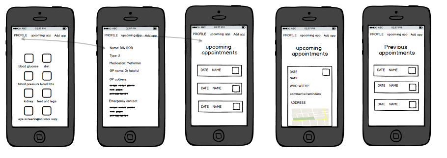
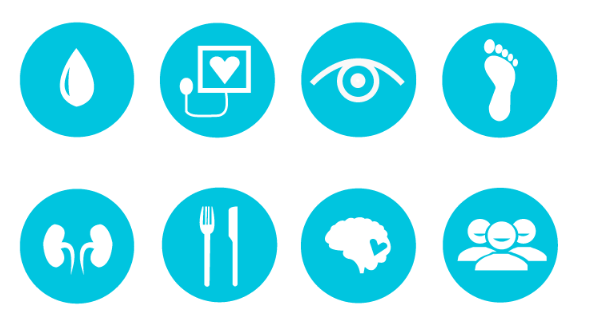
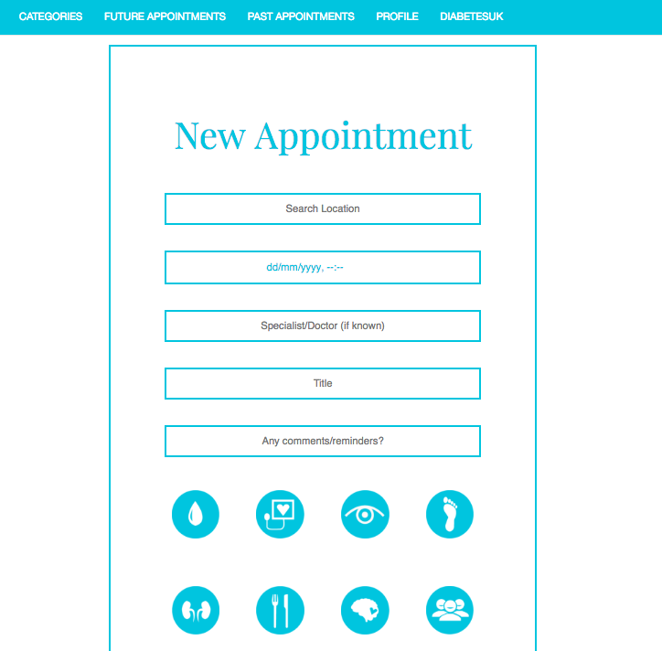
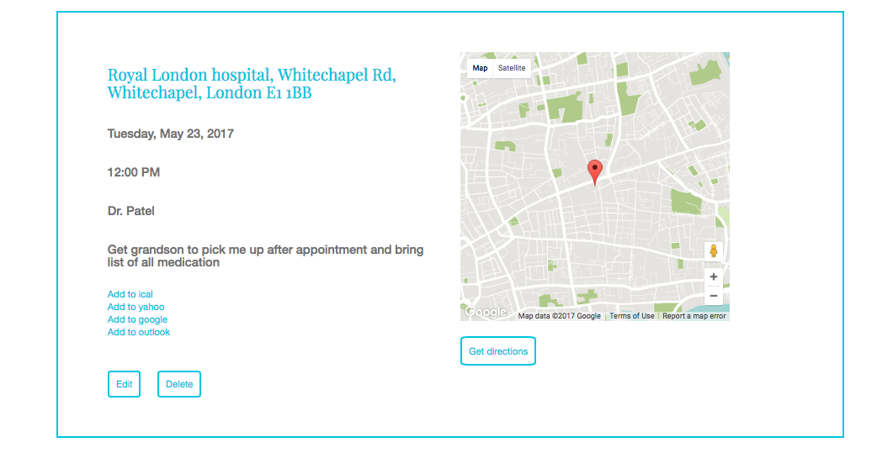

<p align="center" style="padding: 20px 0;">
  
</p>

This application was created using Rails and Angular. It utilises Adobe Illustrator (for the icon design), Google Maps API, CityMapper and iCal. From my previous work with diabetic patients, I decided to focus my final project on the ever growing need for diabetic appointment planning.

*The cost of diabetes to the NHS is over £1.5m an hour or 10% of the NHS budget for England and Wales. This equates to over £25,000 being spent on diabetes every minute. In total, an estimated £14 billion pounds is spent a year on treating diabetes and its complications, with the cost of treating complications representing the much higher cost. The prevalence of diabetes is estimated to rise to 4 million by 2025.
This simple icon based application can help patients keep on top of appointments thus reducing the risk of further complications and cost to the NHS.

Below is some wireframing that I started with in order to figure out how I wanted to tackle the issue of missed appointments with my app.

<p align="center" style="padding: 20px 0;">
  
</p>

Diabetes UK state there are 15 healthcare essentials that diabetic patients need to follow so I broke those down into 8 (combining appointments that more than likely happen at the same time) icons.

<p align="center" style="padding: 20px 0;">
  
</p>

I created them in Adobe illustrator and tried to make them as simple as possible but still easy enough for the user to know what the appointment was about.

As the user logs in, they are presented with their profile. This is just a place for them to store useful information such as GP address and any medication they might be on. This could prove usefull when they need to recall this information at future appointments.

<p align="center" style="padding: 20px 0;">
  
</p>

From the nav bar, the user can then choose to add a new appointment.

<p align="center" style="padding: 20px 0;">
  
</p>

I added an autocomplete for the location of the appointment to make things a bit easier, especially if you only know the name of a particular hospital but not the address. The user can then provide any other useful information and then choose one or more icons that are associated with that appointment.

The user can then view upcoming appointments or any past appointments after I wrote a date function that places appointments in different show pages depending on how they compare with the present date and time.

I decided to utilise the Google Maps api to allow users to visualise where they are going. They can then go on to view directions from City Mapper.

<p align="center" style="padding: 20px 0;">
  
</p>

Most importantly, users can add these appointments to their own person calendars, ensuring that they keep on top of these appointments. I would really like to add notifications from this app in the future once a certain amount of time has passed between appointments. A lot of diabetic appointments must happen at least annually, so reminding the patient to book them if they already haven't would be essential and beneficial to their future care.
Contact GitHub API Training Shop Blog About


### Using this Angular Gulp Setup

To get setup with the starter-code, you first need to run:

```sh
$ bower install && gulp install
```

## How is gulp setup?

Rather than trying to manage one giant `gulpfile.js` that is file responsible for creating multiple tasks, each task has been broken out into its own file and placed in a directory `tasks`. Any files in that directory get automatically required in the gulpfile using the `require-dir` npm package.

To add a new task, simply add a new task file that directory.

/tasks/default.js specifies the default set of tasks to run
when you run `gulp`.

Configuration options are stored in the `package.json` file.

When deploying, ensure that a `postinstall` script has been added to
your package.json, e.g.

```json
"postinstall": "bower install && gulp deploy"
```

This setup expects that there is a bower.json file with at least ONE package
installed. This will created a bower_components directory after
the postinstall script has run.

When deploying, this setup expects that the NODE_ENV is set to `production`.
Also that the NPM_CONFIG_PRODUCTION is set to `false`. Then you can also set the API_URL to be the correct URL for your deployed app. This will automatically replace `http://localhost:4000` to be the correct url.

You can do this by running:

```bash
$ heroku config:set NODE_ENV=production
$ heroku config:set NPM_CONFIG_PRODUCTION=false

# An example url
$ heroku config:set API_URL=https://project-on-heroku.herokuapp.com/
```

### Bower overrides

Sometimes, you might want to `override` the `main` file(s) for a specific Bower component. You can do this directly inside the `bower.json` file like this:

```json
"overrides": {
  "bootstrap": {
    "main": [
      "dist/css/bootstrap.css",
      "dist/js/bootstrap.js",
      "dist/fonts/*"
    ]
  },
  "font-awesome": {
    "main": [
      "css/font-awesome.css",
      "fonts/*"
    ]
  }
},
```
